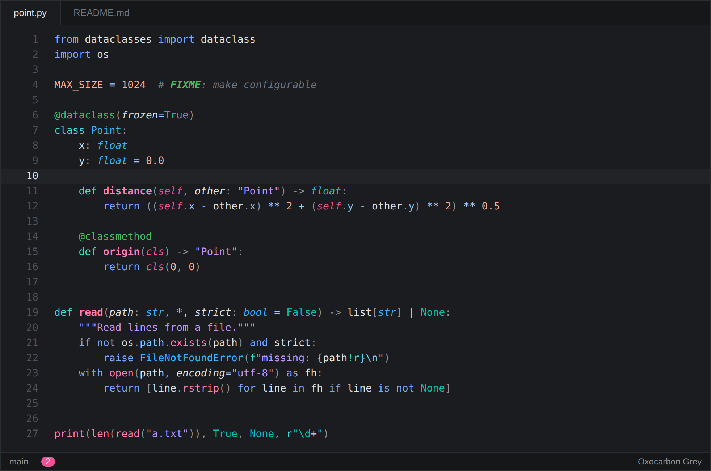
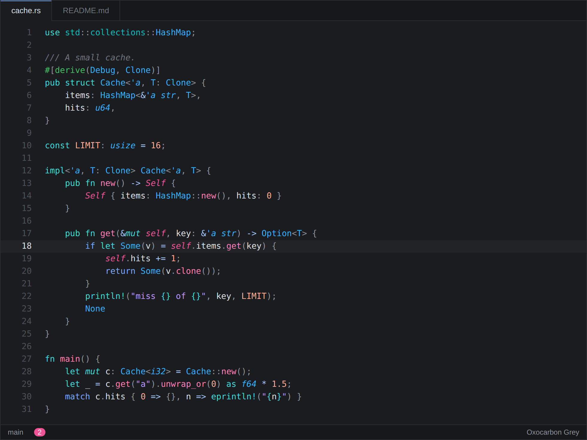
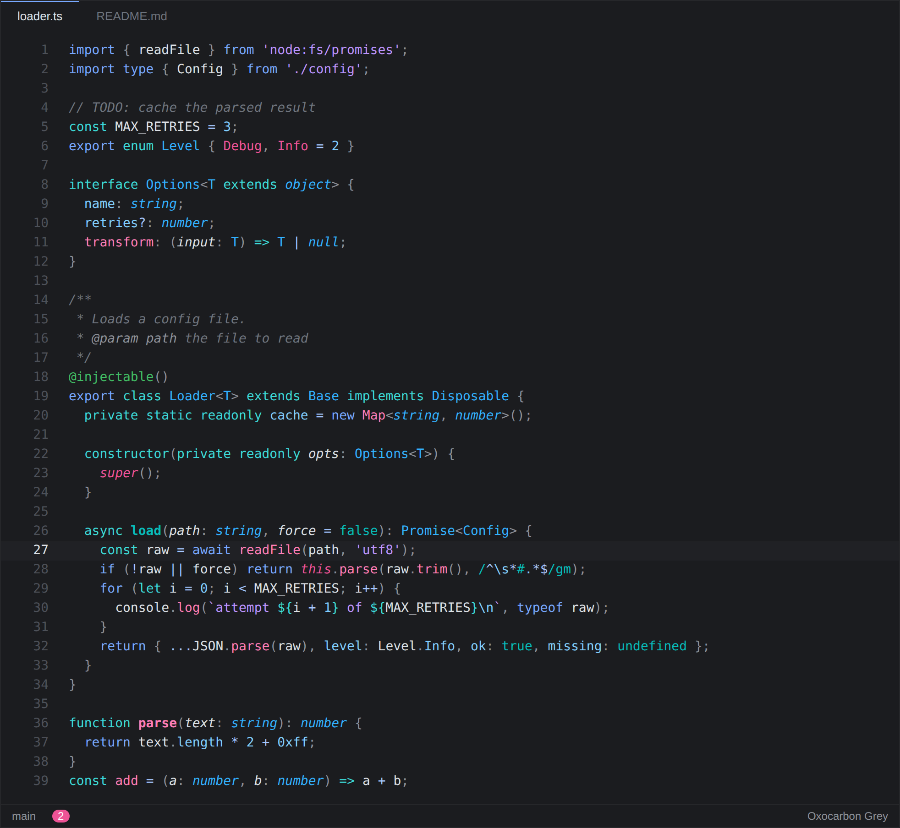
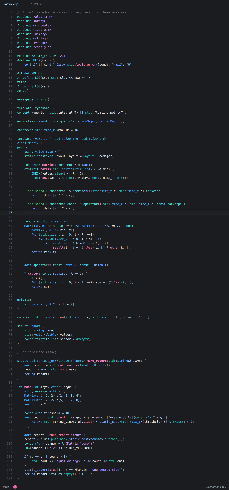

# Oxocarbon Grey

A dark VS Code colour theme built on the [Oxocarbon](https://github.com/nyoom-engineering/oxocarbon.nvim) palette, with two changes:

- **One graphene surface.** The whole window, from the title bar through the sidebar, editor, panel and terminal to the status bar, is a single cool dark grey (`#1b1c1f`) with hairline borders. In VS Code's modern layout the gaps around the rounded parts use the same colour, so the parts don't read as separate cards.
- **More nuanced syntax.** Oxocarbon uses one blue for keywords, types, operators, booleans and tags. Here they are split across the palette, and there is a full semantic token map so language servers (TypeScript, Pylance, rust-analyzer, clangd, gopls) colour things consistently.

## Screenshots

These previews were rendered with [Shiki](https://shiki.style) from the files in [`fixtures/`](fixtures), using the TextMate rules only. With semantic highlighting on, VS Code adds the details listed under [Language support](#language-support).









<!-- TODO: add full VS Code window screenshots (sidebar, terminal, diff editor). -->

## Install

**From Open VSX** (VSCodium, Gitpod, Theia, Cursor and other Open VSX clients), once published:

1. Open the Extensions view (`Ctrl+Shift+X` / `Cmd+Shift+X`).
2. Search for **Oxocarbon Grey** and install it.
3. Run **Preferences: Color Theme** and pick **Oxocarbon Grey**.

Or from the command line:

```sh
codium --install-extension viraj-s15.oxocarbon-grey
```

**From a `.vsix` file:**

```sh
code --install-extension oxocarbon-grey-0.3.1.vsix
```

or use **Extensions: Install from VSIX...** from the command palette.

## Palette

### Greys

| Role | Hex |
| --- | --- |
| Every part of the window, and the gaps between them | `#1b1c1f` |
| Floating widgets: menus, hovers, suggest, quick input, notifications | `#232428` |
| Current line | `#202125` |
| Selection | `#33353b` |
| Borders (hairline) | `#ffffff0d` (5% white) |
| Indent guides, rulers | `#2b2d31` |
| Line numbers | `#4d5159` |
| Foreground, active line number | `#dde1e6` |
| Punctuation, doc comments, lifetimes, secondary text | `#8d9199` |
| Comments, placeholders | `#6e747d` |

### Accents

| Name | Hex | Oxocarbon | Used for |
| --- | --- | --- | --- |
| Blue | `#78a9ff` | base09 | Control keywords, HTML tags, links, UI accent |
| Light blue | `#a6c8ff` | (Carbon blue 30) | Operators, object keys, field declarations |
| Cyan | `#3ddbd9` | base08 | Storage and declaration keywords, macros, interpolation braces |
| Teal | `#08bdba` | base07 | Methods, namespaces, booleans, built-in functions and globals, regex |
| Sky | `#33b1ff` | base11 | Types, classes, interfaces, enums |
| Ice | `#82cfff` | base15 | Numbers, properties, object keys, attributes, escapes |
| Purple | `#be95ff` | base14 | Strings, inline code, warnings |
| Rose | `#ff7eb6` | base12 | Functions, markdown bold |
| Pink | `#ee5396` | base10 | `this` / `self`, Rust `unsafe`, headings, deletions, errors, badges |
| Green | `#42be65` | base13 | Decorators, TODO, additions |
| Cobalt | `#4589ff` | (Carbon blue 50) | Constants, enum members |
| Steel | `#7189b3` | (muted blue) | Terminal bright blue only |

### Syntax

| Token | Colour |
| --- | --- |
| `if` `for` `return` `await` `import` `and` `not` `in` | Blue `#78a9ff` italic |
| `const` `let` `fn` `def` `class` `struct` | Cyan `#3ddbd9` |
| Operators | Light blue `#a6c8ff` |
| Function declarations / calls | Rose `#ff7eb6` bold / regular |
| Methods | Teal `#08bdba` (declarations bold) |
| Python dunder methods | Teal `#08bdba`, never bold |
| Built-in functions and globals (`len`, `print`, `console`, `fetch`) | Teal `#08bdba` |
| Types, classes, interfaces, enums | Sky `#33b1ff` |
| Built-in and library types, traits, interfaces, concepts, type parameters | Sky `#33b1ff` italic |
| Rust lifetimes | `#8d9199` italic |
| Strings | Purple `#be95ff` |
| Escapes, format specs (`!r`, `:.2f`, `%d`) | Ice `#82cfff` |
| Interpolation braces (`${ }`, f-string `{ }`, Rust `{ }`, JSX `{ }`) | Cyan `#3ddbd9`; the code inside uses normal colours |
| Python docstrings | Purple `#be95ff` italic |
| Regular expressions | Teal `#08bdba` |
| Numbers | Ice `#82cfff` |
| Constants, enum members | Cobalt `#4589ff` |
| `true` `false` `null` `None` `nil` `undefined` | Teal `#08bdba` italic |
| Other built-in constants | Teal `#08bdba` |
| Property access, fields | Ice `#82cfff` |
| Object keys, field and member declarations | Light blue `#a6c8ff` |
| Variables | `#dde1e6` |
| Parameters | `#dde1e6` italic |
| `this` `self` `super` `cls` | Pink `#ee5396` italic |
| Decorators, attributes, annotations | Green `#42be65` |
| Namespaces, modules | Teal `#08bdba` |
| Macros (including `!`), preprocessor | Cyan `#3ddbd9` |
| Rust `?` | Blue `#78a9ff` bold |
| Rust `unsafe` | Pink `#ee5396` bold (semantic) |
| Rust mutable bindings | Underlined (semantic) |
| Commas, semicolons, brackets, dots | `#8d9199` |
| Comments | `#6e747d` italic |
| Doc comments (`///`, `/** */`) | `#8d9199` italic |
| TODO / FIXME (where the grammar marks them) | Green `#42be65` bold italic |
| HTML / JSX tags, attributes | Blue `#78a9ff`, ice `#82cfff` |
| Markdown headings, links, inline code | Pink bold, blue, purple |
| Diff inserted / deleted / changed | Green, pink, blue |

Every syntax colour has at least 4.5:1 contrast on both the editor background and the current line. Comments have at least 3.2:1. The terminal ANSI colours have at least 4.5:1 as text (bright black has 3.4:1). `npm run build` checks all of this.

### Terminal

Normal ANSI colours use the accents: pink, green, purple (for yellow, as in oxocarbon.nvim), blue, rose, teal. VS Code uses the same colour for ANSI text and ANSI backgrounds, so white (`#aeb4be`) and bright blue (`#7189b3`) are toned down. Inverse and highlighted text, such as the "History restored" marker, then shows as a muted grey-blue chip instead of a bright block.

## Language support

Python, Rust, TypeScript/TSX and C++ are tuned against VS Code's built-in grammars and each language's main language server. Every role uses the same colour in all four: types are sky, macros cyan, namespaces teal, constants cobalt. Semantic highlighting (on by default) fills in what the grammars can't know, so keep it on for the full effect.

The semantic rules were checked against real output from rust-analyzer, clangd, basedpyright (standing in for Pylance, whose token types come from its published `package.json`) and TypeScript's own classifier, resolved the way VS Code resolves them. Some things the servers can't express: with rust-analyzer, `use`, `as` and `in` are upright, and `.`/`::` use the operator colour; with basedpyright, dunder declarations are bold and `typing` names are upright; with tsserver, decorator names and `as const` take the function and type colours.

| Language | TextMate grammar | Only with semantic highlighting |
| --- | --- | --- |
| Python (Pylance) | Decorators, f-string braces and the code inside them, docstrings, `int`/`str`/`list` in annotations, dunder methods, `self`/`cls`, keyword arguments, built-in functions, `match`/`case`, walrus, `async`/`await` | Imported module names, `typing` names (`Optional`, `Callable`), user classes in annotations, `list[...]` in subscripts, readonly class constants accessed via `self` |
| Rust (rust-analyzer) | Macros with `!`, attributes and derives, lifetimes, `?`, `&`/`&mut`/`*`, `Some`/`None`/`Ok`/`Err`, format-string braces, `///` doc comments, trait declarations, `macro_rules!` metavariables | `unsafe` and raw-pointer derefs (pink bold), mutable-binding underline, enum variants, traits used as types (italic), `Self` as a type, types before `::`, parameters, fields, method calls, `//!` inner doc comments |
| TypeScript / TSX (tsserver) | Interfaces, aliases, generics, enums and members, `readonly`, `?`, decorators, `${}` interpolation, `this`, object keys vs property access, `as`/`satisfies`, `?.`/`??`, JSX components vs HTML tags, attributes, `{}` expressions, `new X()` | Interfaces as italic when used, `console`/`Array`/`Object` as built-ins, method calls vs function calls, `Promise` in type positions |
| C++ (clangd) | Preprocessor directives, `<header>`/`"header"`, `#define` names, `ALL_CAPS()` macro calls, namespaces, classes, constructors, templates, template parameters, `constexpr`/`consteval`/`const`/`volatile`, `*`/`&`/`&&`, operator overloads, lambda captures, `[[nodiscard]]`, raw strings, `nullptr` | Concept names, `std::` types as library types (italic), enum members after `::`, macros used without parentheses, `auto` as a keyword, namespace-scope `constexpr` as constants, static members, non-type template parameters (cobalt), fields |

## Customising or building

All colours live in [`src/palette.mjs`](src/palette.mjs). The generator needs Node 20.15+ and has no dependencies:

```sh
npm run build     # regenerate themes/oxocarbon-grey-color-theme.json and images/icon.png
npm run check     # fail if the committed theme is out of date
npm run package   # build, then create oxocarbon-grey-<version>.vsix with @vscode/vsce
```

| File | Contents |
| --- | --- |
| `src/palette.mjs` | Greys, accents, syntax roles, ANSI colours |
| `src/ui.mjs` | Workbench colours |
| `src/tokens.mjs` | TextMate token rules |
| `src/semantic.mjs` | Semantic token colours |
| `src/contrast.mjs` | WCAG contrast checks |
| `src/icon.mjs` | Draws the extension icon |

To tweak a single colour without forking, use `workbench.colorCustomizations`, `editor.tokenColorCustomizations` or `editor.semanticTokenColorCustomizations` in your settings, scoped to `"[Oxocarbon Grey]"`.

## Credits

- Palette and original syntax mapping: [oxocarbon.nvim](https://github.com/nyoom-engineering/oxocarbon.nvim) by Nyoom Engineering, MIT licensed.
- Oxocarbon itself is based on IBM's [Carbon](https://carbondesignsystem.com) colour palette.

## License

[MIT](LICENSE)
