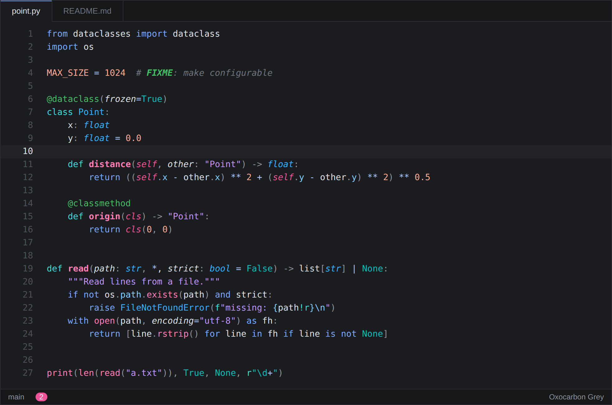
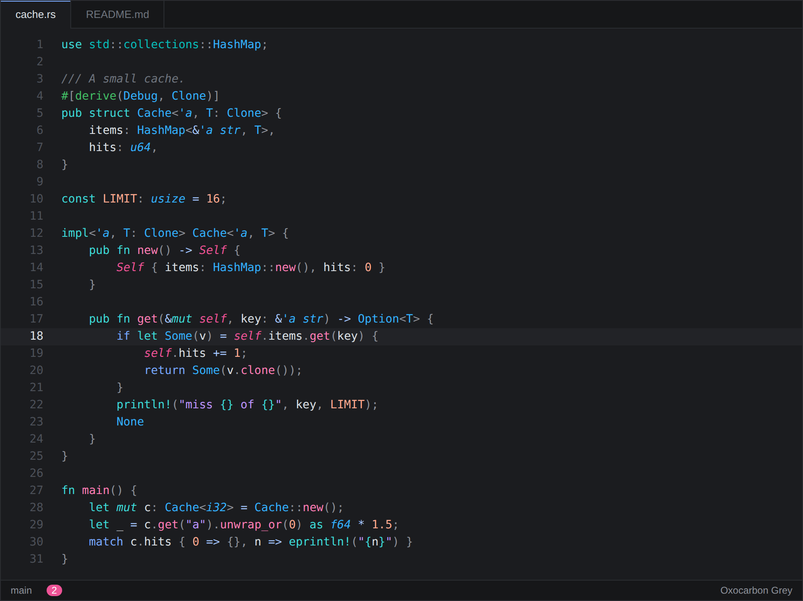
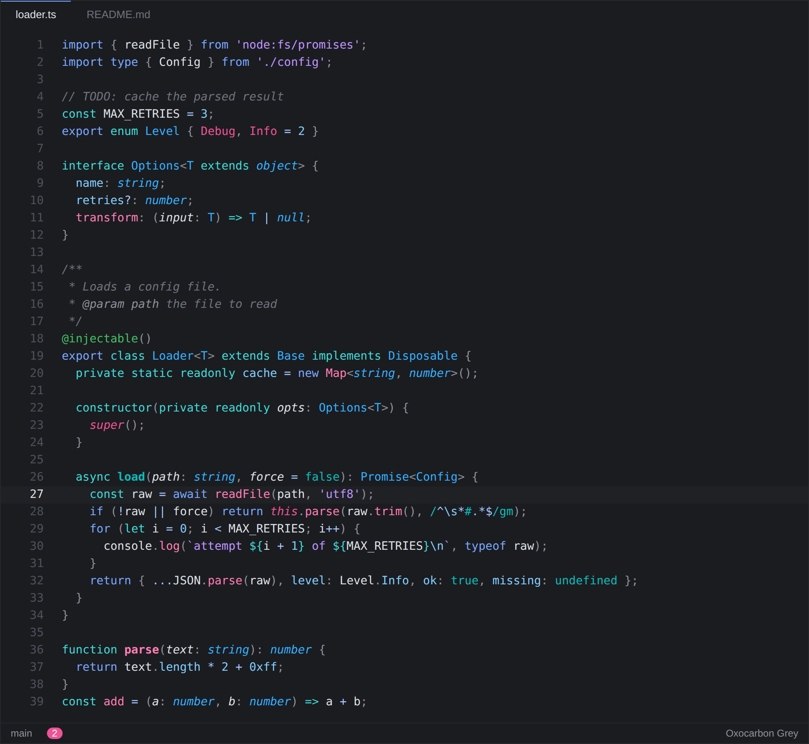
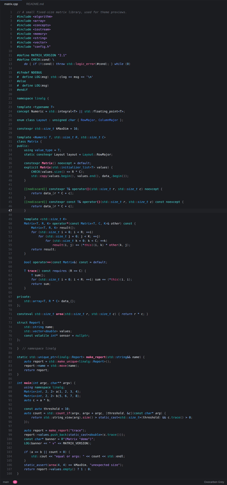

# Oxocarbon Grey

A dark theme based on [Oxocarbon](https://github.com/nyoom-engineering/oxocarbon.nvim), with a flat graphene background and richer syntax colours. Supports Python, Rust, TypeScript and C++. Available for VS Code, Zed, Neovim, Ghostty and herdr.

[Preview the theme on the website](https://viraj-s15.github.io/oxocarbon-grey/).



<details>
<summary>Rust, TypeScript and C++ previews</summary>







</details>

## VS Code

Install from the [VS Code Marketplace](https://marketplace.visualstudio.com/items?itemName=viraj-s15.oxocarbon-grey) or [Open VSX](https://open-vsx.org/extension/viraj-s15/oxocarbon-grey), or run:

```sh
code --install-extension viraj-s15.oxocarbon-grey
```

Select **Oxocarbon Grey** in the Color Theme picker. Keep semantic highlighting on for the full effect.

## Zed

Not published to Zed's extension registry yet. Install it locally:

```sh
git clone https://github.com/viraj-s15/oxocarbon-grey
```

1. Open Zed's Extensions page and click **Install Dev Extension**.
2. Select the repository's `zed/` directory, not the repository root.
3. Pick **Oxocarbon Grey** in the theme selector.

Keep the clone: Zed loads the extension from that directory. No build step is needed.

## Neovim

Requires **Neovim 0.10+** and a true-colour terminal. With [lazy.nvim](https://lazy.folke.io/spec):

```lua
{
  "viraj-s15/oxocarbon-grey",
  lazy = false,
  priority = 1000,
  config = function()
    vim.cmd.colorscheme("oxocarbon-grey")
  end,
}
```

Supports Tree-sitter and LSP semantic highlighting, plus Telescope, Gitsigns and blink.cmp. Install the appropriate [nvim-treesitter](https://github.com/nvim-treesitter/nvim-treesitter) parsers for your languages.

Optional configuration, before loading the colorscheme:

```lua
require("oxocarbon_grey").setup({
  italic = true,
  bold = true,
  overrides = {
    -- Comment = { fg = "#8d9199", italic = false },
  },
})
vim.cmd.colorscheme("oxocarbon-grey")
```

Overrides replace the whole highlight group. No `setup()` call or build step is needed for the defaults.

## Ghostty

Download the theme into Ghostty's themes folder (on both macOS and Linux):

```sh
dir="${XDG_CONFIG_HOME:-$HOME/.config}/ghostty/themes"
mkdir -p "$dir"
[ -e "$dir/oxocarbon-grey" ] || curl -fsSL -o "$dir/oxocarbon-grey" \
  https://viraj-s15.github.io/oxocarbon-grey/ghostty/oxocarbon-grey
```

Set this in your Ghostty config, replacing any existing `theme` line:

```ini
theme = oxocarbon-grey
```

On macOS, **Settings…** opens the config. On Linux, use `$XDG_CONFIG_HOME/ghostty/config.ghostty` (usually `~/.config/ghostty/config.ghostty`). Reload with <kbd>cmd-shift-,</kbd> on macOS or <kbd>ctrl-shift-,</kbd> on Linux.

Colour settings in your own config override the theme. This is separate from Ghostty's built-in **Oxocarbon** theme.

## herdr

### Desktop app

1. Download the theme into the herdr-app themes folder:

   ```sh
   dir="${HERDR_APP_HOME:-$HOME/.config/herdr-app}/themes"
   mkdir -p "$dir"
   curl -fsSL -o "$dir/oxocarbon-grey.json" \
     https://viraj-s15.github.io/oxocarbon-grey/herdr/oxocarbon-grey.json
   ```

2. Open **Settings → Look** and pick **oxocarbon-grey**, or run `herdr-app do app.theme --name oxocarbon-grey`.

herdr-app finds the file live, so no restart is needed. The theme sets the terminals and the panels, and each layout keeps its own theme.

### Terminal app

The theme colours herdr's own UI: the sidebar, tab bar, popups and agent status markers. Panes keep your terminal's colours, so use the Ghostty theme there too.

1. Remove any `[theme.custom]` table from `~/.config/herdr/config.toml`.
2. Add the theme to the end of the config:

   ```sh
   { printf '\n'; curl -fsSL https://viraj-s15.github.io/oxocarbon-grey/herdr/oxocarbon-grey.toml; } \
     >> "${HERDR_CONFIG_PATH:-$HOME/.config/herdr/config.toml}"
   ```

3. Reload the running server with `herdr server reload-config`.

The theme sets every colour token, so your `theme.name` has no effect while it is there. To remove it, delete the `[theme.custom]` table and reload.

## Development

The shared palette lives in `src/palette.mjs`. Generated theme files are committed. `terminalthemes/Oxocarbon Grey.yml` is the file to upload to [terminalthemes.com](https://terminalthemes.com).

```sh
npm run build       # regenerate all the themes
npm run check       # check generated files and run tests
npm run build:site  # build the website into _site/
npm run package     # package the VS Code extension
```

## Credits

[oxocarbon.nvim](https://github.com/nyoom-engineering/oxocarbon.nvim) by Nyoom Engineering, based on IBM's [Carbon](https://carbondesignsystem.com) palette.

## License

[MIT](LICENSE)
